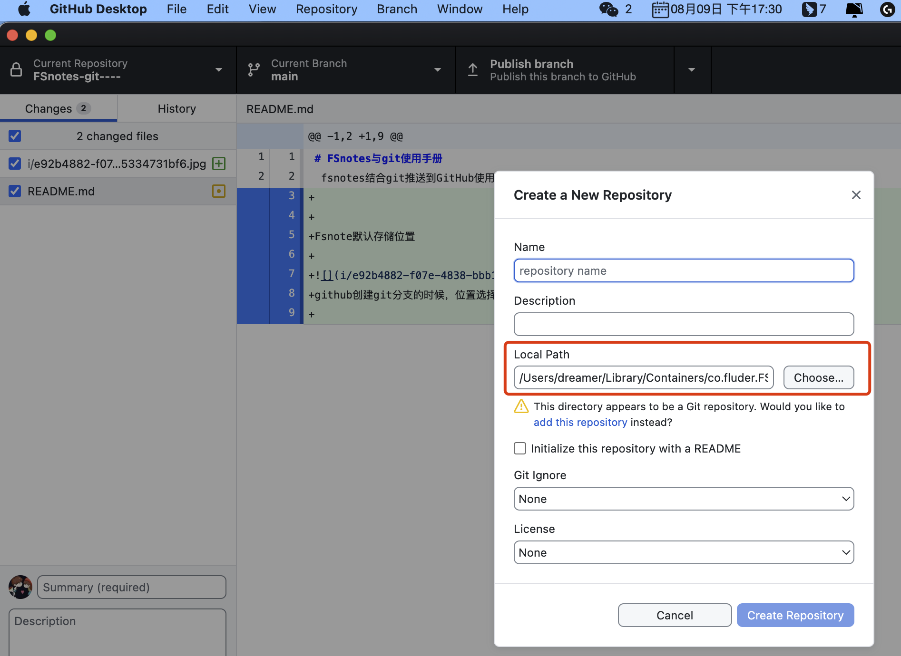

# FSnotes与git使用手册
## fsnotes结合git推送到GitHub使用手册

## Fsnote默认存储位置
FastNote git拉取位置：/Users/dreamer/Library/Containers/co.fluder.FSNotes/Data/Documents
旧项目拉取路径：/Users/dreamer/Documents/GitHub/RocketMq/RocketMQ笔记总结.xmind

github创建git分支的时候，位置选择该位置
把文件编辑文档位置location变成项目git本地仓库

